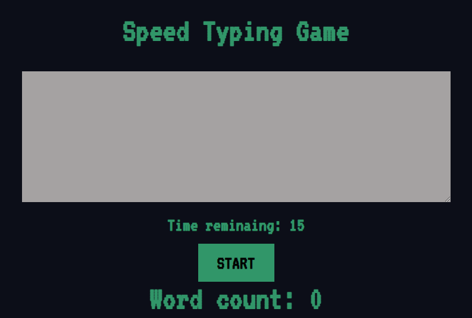

# Chirag Mehta - Speed Typing Game

This is game I bulit while following a tutorial from [Bob Ziroll](https://scrimba.com/teachers/bobziroll) on [Scrimba](https://scrimba.com/). I am currently enrolled at [The School of Code](https://www.schoolofcode.co.uk/) and have bulit this game to improve my knowledge of React hooks.

## Table of contents

- [Running Locally](#running-locally)
  - [React Scripts](#react-scripts)
- [Overview](#overview)
  - [My Goals](#my-goals)
  - [Screenshot](#screenshot)
  - [Links](#links)
- [My process](#my-process)
  - [Built with](#built-with)
  - [What I learned](#what-i-learned)
  - [Continued development](#continued-development)
  - [Useful resources](#useful-resources)
- [Author](#author)

## Running Locally

### React Scripts

This project was bootstrapped with [Create React App](https://github.com/facebook/create-react-app).

In the project directory, you can run:

### `npm start`

Runs the app in the development mode.\
Open [http://localhost:3000](http://localhost:3000) to view it in your browser.

The page will reload when you make changes.\
You may also see any lint errors in the console.

### `npm test`

Launches the test runner in the interactive watch mode.\
See the section about [running tests](https://facebook.github.io/create-react-app/docs/running-tests) for more information.

### `npm run build`

Builds the app for production to the `build` folder.\
It correctly bundles React in production mode and optimizes the build for the best performance.

The build is minified and the filenames include the hashes.\
Your app is ready to be deployed!

## Overview

### My goals

Players should be able to:

- Play the game on mobile, tablet and desktop devices
- Press start button and immediately begin typing
- Have their high score tracked during each play session

Players should not be able to:

- Type anything in the textarea until the game starts
- Create new lines and have these counted as valid words

### Screenshot



### Links

- Live Site URL: [speed-type-games.netlify.app](https://speed-type-games.netlify.app/)

## My process

### Built with

- Semantic HTML5 markup
- CSS custom properties
- Mobile-first workflow
- [React](https://reactjs.org/) - JS library

### What I learned

One of my major learnings was how to use custom CSS properties. I love how sementic variable names make CSS more readable. Although this is a tiny CSS file I can really see the benefit this would have in much larger project for reducing bugs and having a single source of all your major CSS properties. Example code below:

```css
html {
  /* Colors */
  --primary-clr: hsl(153, 51%, 39%);
  --dark-clr: rgb(12, 14, 24);

  /* Fonts */
  --fs-title: 2.75rem;
  --fs-word-count: 2.25rem;
  --fs-reg: 1.6rem;

  --ff-reg: "VT323", monospace;
  --fw-reg: 400;
  --fw-bold: 700;

  /* Spacing */
  --padding-large: 2em;
  --padding-small: 1em;
  --textarea-height: 250px;
}
```

Also pleased with the countWords function that solves quite a few obvious bugs in the game. There's regex which reduces multiple spaces to a single space. I learned of the .trim() method which takes away whitespaces at beginning or end of string.

setWordCount is a useState function which utilises .split() and .length to count the words.

```js
function countWords(str) {
  str = str.replace(/[ ]{2,}/gi, " ");
  str = str.trim();
  // split returns array with space between which we then .length
  setWordCount(str.split(" ").length);
  if (str === "") {
    setWordCount(0);
  }
}
```

The other major thing was React hooks, especially useEffect and useRef. Was intresting figuring out the game logic on paper before coding and thinking about when useEffect would render. Hit a snag deploying to Netlify so needed to include 'eslint-disable-next-line' to make it play nice.

```react
useEffect(() => {
    if(timeRemaining > 0 && isTimeRunning) {
      setTimeout(() => {
        setTimeRemaining(prevtime => prevtime - 1)
      }, 1000)
    } else if(timeRemaining === 0) {
      handleGameEnd()
    }
  // eslint-disable-next-line
  }, [isTimeRunning, timeRemaining])
```

### Continued development

Currently, the game counts any words you type if they are spelt correctly or not. This means someone could type anything with some spaces and get a high score. It would be great to implement a spellschecker so only correctly spelt words get counted towards your high score.

I'm sure there's an npm module that would do this so I might revisit at some point.

### Useful resources

- [Scrimba React Hooks - video playlist](https://scrimba.com/playlist/pMvMEuD) - I followed along to this guide from Bob Ziroll however I coded everything myself and checked it worked. The planning was done by following his guidance though. Couldn't recommend Scrimba or Bob's videos enough. Really clear, concise explanations of hooks and why bugs are happening inside React.
- [React.useEffect() Explanation](https://dmitripavlutin.com/react-useeffect-explanation/) - I needed further guidance on useEffect and this explanation finally helped me crack it!

## Author

- Website - [My portfolio site](https://chirag-designs-f2wb3.ondigitalocean.app/)
- LinkedIn - [chiragmehtauk](https://www.linkedin.com/in/chiragmehtauk/)
